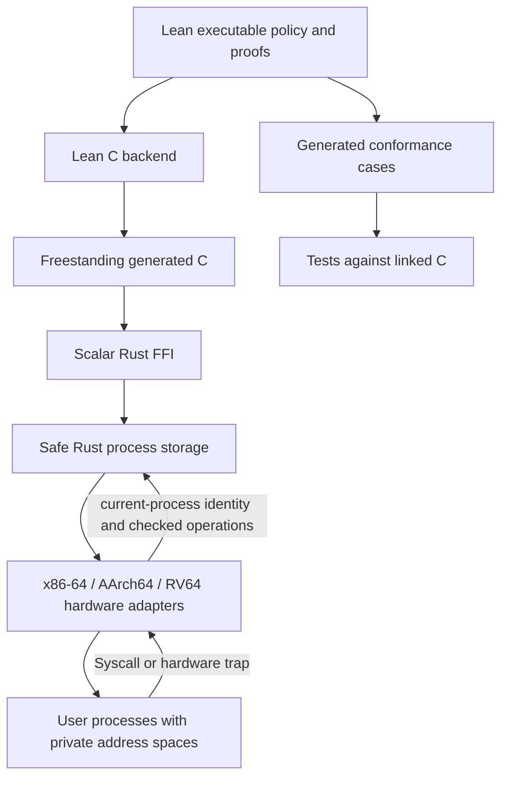

# Architecture and trust assumptions

## Layering

The core is trusted kernel code, not a library exposed directly to an application. Methods such as `spawn`, `grant`, `reserve_pages`, `release_pages`, and `snapshot` are management interfaces callable only by the trusted loader or hardware adapter. Process-control syscalls obtain the caller from `current`; console/status adapters use that same scheduled identity and check launch authority before copying bytes.

All resource admission, account updates, identifier rules, capability predicates, scheduler selection, legacy syscall-number validation, user-return sanitization, and final page permission values are implemented in `Bastion.Runtime`. Its 40 exports also cover frame/IP/UDP/TCP bounds, ports, datagram limits, and bounded network polling. Rust retains fixed arrays, traversal of stored entries, transaction ordering, and assignment of approved results. This split avoids a heap-dependent Lean object runtime in the kernel. The safe core calls a separate, narrow FFI crate. Details and compiler provenance are in [EXTRACTION.md](EXTRACTION.md).

## Memory and process state

The portable core has eight process slots and eight capability slots per process. The x86 boot demo starts five processes, then loads a sixth process for init. ARM/RV start init and four probes. Each assembly probe reserves six private physical pages: one code page, one data/stack page, and four page-table pages. There is no dynamic user allocation syscall yet. A page quota failure during boot demonstrates admission control; physical protection is exercised separately by the user-mode attacks.

Every assembly probe sees code at `0x400000` and stack/data at `0x500000`, backed by distinct physical pages. The stack begins at `0x501000` and grows down. Code is user-readable and executable but not writable. Data is user-readable/writable and non-executable. Other lower-half addresses are unmapped. Upper-half kernel mappings are inherited with the user-access bit cleared at the top page-table level.

The ELF init process has 16 code pages and 16 data/stack pages plus four reserved
page-table pages. Its stack starts at `0x510000`. See [USERSPACE.md](USERSPACE.md)
for checked copies and the loader profile, and [PORTS.md](PORTS.md) for ARM/RV page tables.

On x86, supervisor write protection and NX are enabled. The bootloader's direct-map alias remains supervisor-only; the kernel is trusted and can access user backing pages through its own mappings. This is process isolation, not isolation of mutually distrusting kernel components. The fixed kernel stacks and bookkeeping are shared kernel overhead, outside the per-process six-page quota.

Process IDs and capability handles come from one monotonically increasing counter. They are never reused during a boot. Counter exhaustion fails closed. On process removal, the core releases its resource charges and removes every capability pointing at that identity. The hardware adapter never schedules the removed page table again. Backing frames are statically reserved for the entire demo; accounting release does not imply a working reusable physical allocator. Any future reuse must revoke mappings, flush translations, and scrub data first.

## Capability boundary

A PID is a name and confers no authority. Handles select entries only in the scheduled process's capability table. `INSPECT` and `TERMINATE` are separate rights. `Restrict` can remove rights but cannot add them; `Close` invalidates an entry. Fresh handle values prevent a stale handle from naming a new capability.

Only the trusted bootstrap API can mint capabilities. Cross-process delegation, derivation trees, IPC endpoints, and user process creation are future work. The boot demo grants no cross-process authority; its forged handle must fail. Rust tests exercise positive grants, attenuation, cross-owner denial, close/reuse, and target destruction.

## CPU accounting

The core uses a global fixed replenishment period and per-process remaining credit. The x86 boot adapter sets the period to 100,000,000 TSC units and each process's budget to 20,000,000 units. A trap charges elapsed time before handling a syscall, fault, or timer. Yields do not replenish credit. Once credit is zero, the scheduler skips the process until the next period. Skipped periods do not bank credit.

The 8254 PIT is programmed for approximately 1 kHz; timer interrupts force a scheduler decision. The hardware prototype uses periodic interrupts rather than programming the core's precise `deadline()`. Consequently a process can overrun a budget until the next delivered interrupt. This is not a hard real-time ceiling. TSC time measures elapsed residency, including time while the host deschedules the virtual CPU, rather than exact host CPU consumption. Interrupt delivery, virtual TSC behavior, and kernel trap costs therefore affect effective quotas. An APIC/deadline timer and clock calibration are required for tighter production accounting.

The single-CPU adapter masks interrupts during boot and all trap handling. User processes and the idle loop are the only interruptible contexts. An exclusive mutable reference protects core transitions; it is not an SMP lock. Secondary CPUs are not started.

## Privilege transitions

The x86 kernel installs its own GDT, TSS, and IDT. Ring transitions use a kernel-owned stack; double faults use a separate emergency stack. All general-purpose registers are saved on entry. User-visible arithmetic/DF flags are preserved while unsafe return flags are removed, CS/SS are fixed, and noncanonical upper-half return addresses are rejected. `INT 0x80` is the sole syscall mechanism: SYSCALL is disabled and SYSENTER has a null code selector. I/O permissions exclude user port access.

Floating-point/SIMD use is disabled because extended-register context switching is not implemented. FS/GS bases are cleared and unprivileged FSGSBASE writes disabled; TLS is not part of this initial ABI. Console/status calls validate ranges through Lean-generated C and copy using kernel-owned mappings of private backing pages. They never directly dereference or retain the supplied virtual pointer. Legacy debug reports carry bounded scalar values only. Unexpected user exceptions terminate the offending process; kernel exceptions halt with diagnostics.

The legacy x86 demo ABI uses `RAX` for the operation and `RDI` for a handle or report value:

| RAX | Meaning | Return in RAX |
|---|---|---|
| 0 | SelfInfo | Current process ID |
| 1 | Inspect capability | Target process ID |
| 2 | Terminate capability | 0 on success |
| 3 | Yield | 0 when resumed |
| 4 | Exit | Does not resume |
| 5 | Embedded test report | 0; no arbitrary console string/pointer |

Errors return `u64::MAX`. The portable `Restrict` and `Close` calls are tested but not yet exposed by the boot adapter. The serial shell is a separately linked Rust ELF loaded at boot. The portable ABI v1 adds calls 64–67 for console/status access; see [USERSPACE.md](USERSPACE.md).

## Proof scope

| Lean theorem | Property |
|---|---|
| `reserve_safe` | A successful reservation stays below the limit |
| `reserve_exact` | A successful reservation adds exactly the request |
| `reserve_word_bound` | A bounded limit also bounds the result to a Rust word |
| `reserve_rejects_excess` | A request exceeding the limit is rejected |
| `release_conserves` | Released amount plus remaining ownership equals prior ownership |
| `charge_never_increases` | Charging cannot create credit |
| `charge_split` | Splitting work across calls cannot create credit |
| `account_bounded` | Replenishment/accounting stays below budget under its stated precondition |
| `restrict_no_amplification` | Accepted restriction does not add rights |
| `other_owner_denied` | A capability from a different owner cannot authorize an operation |
| `dead_target_denied` | A dead target cannot authorize an operation |

These 11 abstract theorems remain in place. Another 35 theorems apply to the exact executable `UInt64`/`Bool` definitions supplied to the C compiler: reservation and charge refinement, accepted reservation bounds, rejection preserving prior state, release conservation, identifier exhaustion, rights restriction, wrong-owner/dead-target rejection, scheduler bounds and empty-mask behavior, safe user flags, supervisor mappings, read-only code, NX data, UDP bounds, fragment rejection, bounded polling, TCP header bounds, zero-port rejection, outbound datagram limits, console input bounds and printable input, rejected-line append denial, console poll bounds, user-copy bounds, ELF admission, and ARM/RV leaf permissions.

The total is 46 checked theorems with no admitted placeholders or custom axioms. The executable source uses machine words; refinement lemmas relate selected functions to the natural-number model. Tests compare linked C against 22,309 executions of the Lean runtime definitions, 1,254 executions of the abstract model. These comparisons do **not** verify the Lean/C compilers, extraction adapter, Rust process-table updates, or hardware adapters. The core still trusts the adapter to report time and identity correctly.

## Serial console boundary

The command parser, line editor and output formatting now run in init, a separate
user process. Fixed launch grants authorize console and system status; every call
checks the scheduled owner and bounded mapped buffers. The kernel only queues UART
bytes and returns fixed records. The editor still calls Lean-generated C in its own
address space. There is no serial login or userspace socket API. See
[CONSOLE.md](CONSOLE.md) and [USERSPACE.md](USERSPACE.md).

## Network boundary

The TCP/UDP stack and echo services are trusted kernel components. They do not add
user syscalls or give embedded processes NIC access. The driver uses static
supervisor DMA buffers, validates completions, and handles at most eight receive
completions and eight transmit-token reservations per timer interrupt. Invalid
completions disable the NIC. There is no IOMMU boundary against a hostile device.
Network work has no separate service quota; interrupt overhead affects the elapsed-TSC accounting above. See [NETWORK.md](NETWORK.md)
and the [userspace interface](USERSPACE.md).

## Threat model and current limits

The implemented boundary covers direct user accesses to kernel/other process memory, user code writes, data execution, forged or insufficient capabilities, and monopolizing the CPU through an infinite loop. It assumes a trusted boot image, bootloader, compiler, firmware, CPU, and cloud hypervisor.

There is no claim of resistance to microarchitectural side channels, hostile DMA devices, compromised kernel code, hypervisor attacks, secure/measured boot attacks, or complete denial-of-service prevention. Virtio networking introduces DMA and a trusted Rust protocol stack. There is no formal noninterference or scheduler fairness proof. Full fault-vector coverage, FPU/TLS state, provider hardware quirks, and malicious arbitrary application loading require further work before production use.

Primary architecture references: [Intel system programming manuals](https://www.intel.com/content/www/us/en/developer/articles/technical/intel-sdm.html), [Limine protocol](https://github.com/limine-bootloader/limine/blob/v8.x/PROTOCOL.md), and [seL4's capability introduction](https://docs.sel4.systems/Tutorials/capabilities.html). This implementation is independent of seL4 and inherits none of its verification claims.
